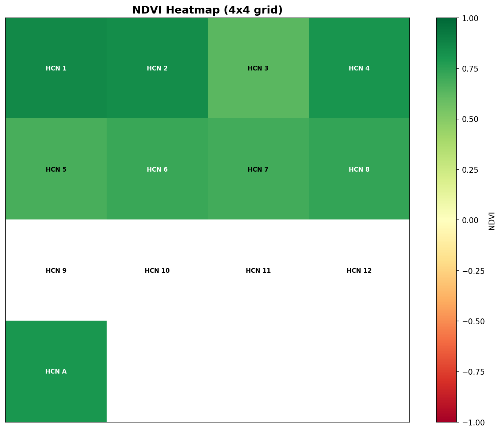
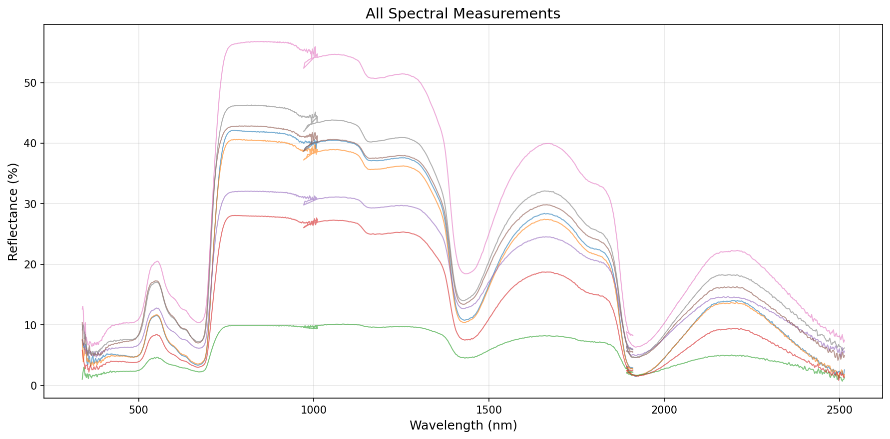

# HyperKey Processing Report

Generated: 2026-05-05 12:18:50

## Processing Summary

| Metric | Value |
|---|---:|
| Total rows in metadata | 25 |
| Successfully matched files | 8 |
| Blank FileNum rows | 7 |
| Invalid FileNum rows | 0 |
| Missing .sig files | 1 |

## Generated Files

- Merged CSV: C:\Users\mathu\hyperkey\data\output_data\merged_spectral_data.csv
- Log file: C:\Users\mathu\hyperkey\data\output_data\error_log.txt

## Visualisations

This section includes:

###NDVI Heatmap

###All spectral measurements

